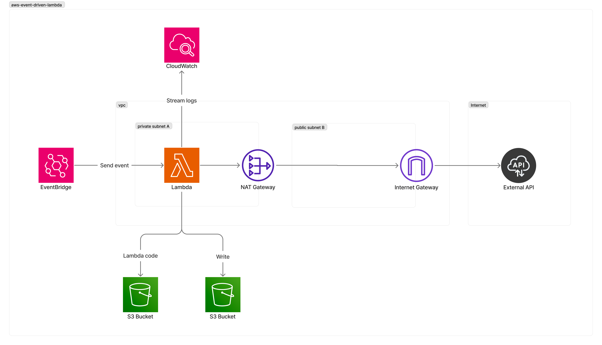

# aws-event-driven-lambda

This is a sample project to demonstrate how to build an event driven lambda function using AWS Lambda, S3, EventBridge and CloudWatch.

# Table of Contents
* [Prerequisites](#prerequisites)
* [Architecture Overview](#architecture-overview)

## Prerequisites

**Technologies**: Clojure, Terraform, Jenkins and AWS 
**Versions**: Leiningen 2.9.10, Java 19 (Corretto), Terraform v1.5.0, Jenkins 2.263.4

- [AWS CLI](https://docs.aws.amazon.com/cli/latest/userguide/cli-chap-install.html)
- [Terraform](https://learn.hashicorp.com/tutorials/terraform/install-cli)
- [Jenkins](https://www.jenkins.io/doc/book/installing/)
- [Leiningen](https://leiningen.org/#install)

## Architecture Overview

1. AWS Lambda should be inside the VPC if it needs to access private resources within the VPC. 
2. Create a VPC endpoint for S3 to allow secure, private connectivity between the VPC and S3.
3. CloudWatch and EventBridge cannot be places inside a VP but can interact with resources inside a VPC.
4. Apply security groups to the lambda function for added security.

Lambda functions can be connected to private subnets within a VPC to access private resources (like EC2 instances or API's behind VPC-controlled endpoints). 

However, if the Lambda function needs to fetch data from an external API, it needs to be connected to a public subnet with a NAT Gateway to access the internet.

Amazon CloudWatch and EventBridge are also global services and cannot be placed inside a VPC. However, they can interest with resources inside a VPC. For instance, Lambda functions inside a VPC can send logs to CloudWatch and receive events from EventBridge.
